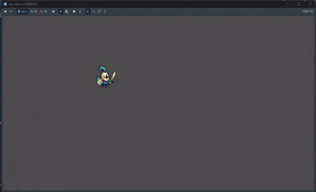
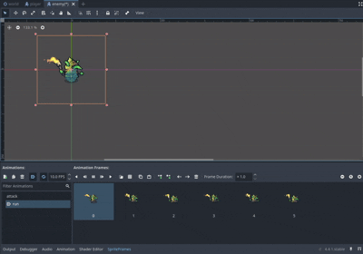

# top-down-yt
First RPG game Godot Engine

 ### Part 1
Create the scene with the character and give him the movements of both walking and attacking, I show below:

  

 ### Part 2
Creating the enemy and its movements, followed by being able to put attacks on the main character, also
the enemy will follow the player, I show below:

  

 ### Part 3
instantiate multiple enemies and adding a timer, I show below:
	

  

